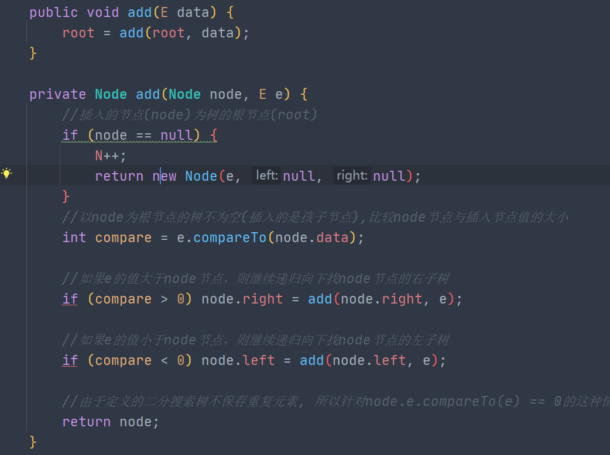
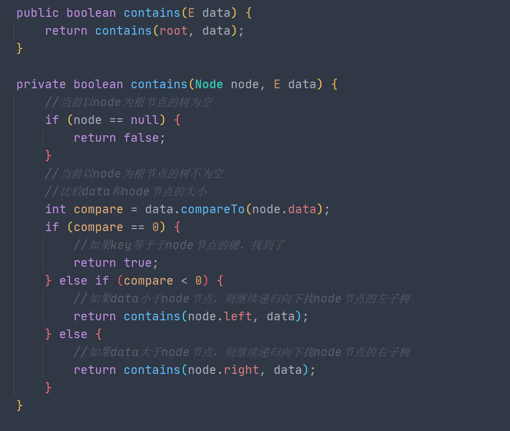
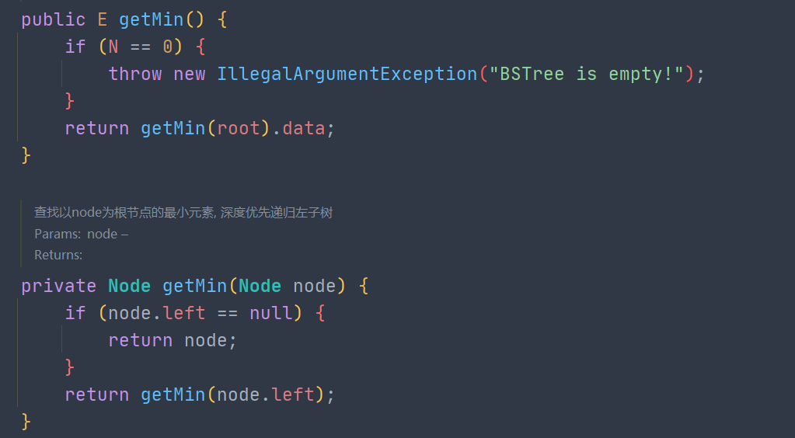
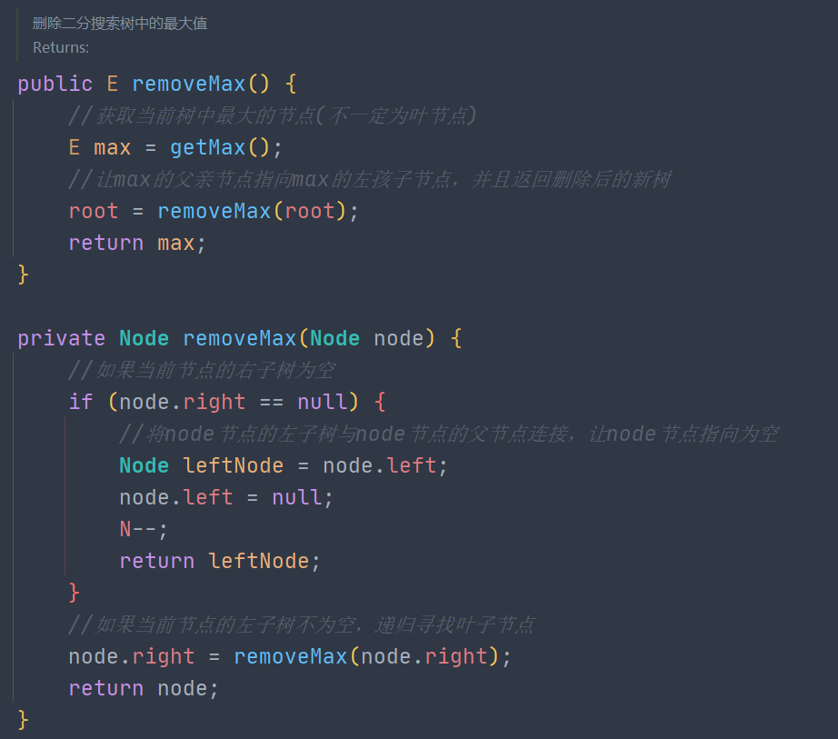

### 前-中-后遍历

```java
public void preOrderNR() {
    Stack<Node> stack = new Stack<>();
    stack.push(root);
    while (!stack.isEmpty()) {
        Node node = stack.pop();

        System.out.print(node.data + " ") ;
        if (node.right != null)  stack.push(
        if (node.left != null)   stack.push(
    }
}
  
            
//中序遍历非递归
public void inOrderNR() {
    if (root == null)   return;
    Stack<Node> stack = new Stack<>();
    Node node = root;
    while (!stack.isEmpty() || node != null)
        // 将当前节点的左子树全部入栈
        while (node != null) {
            stack.push(node);
            node = node.left;
        }
        node = stack.pop();
        System.out.print(node.data + " ");
        node = node.right;
    }
}

            
// 后续遍历非递归--双栈
public void postOrderNR_Stack() {
    if(root == null)    return;
    Stack<Node> stack1 = new Stack<>();
    Stack<Node> stack2 = new Stack<>();
    stack1.push(root);
    while(!stack1.isEmpty()) {
        Node node = stack1.pop();
        stack2.push(node);
        if (node.left != null) {
            stack1.push(node.left);
        }
        if (node.right != null) {
            stack1.push(node.right);
        }
    }
    while (!stack2.isEmpty()) {
        System.out.println(stack2.pop().data
    }
}
/**
 * @Topic:后续遍历非递归--指针
 */
public void postOrderNR() {
    if (root == null) return;
    Stack<Node> stack = new Stack<>();
    Node node = null;
    stack.push(root);
    while (!stack.isEmpty()) {
        Node peek = stack.peek();
        if (peek.left != null && peek.left !
            stack.push(peek.left);
            node = peek.left;
        } else if (peek.right != null && pee
            stack.push(peek.right);
            node = peek.right;
        } else {
            Node pop = stack.pop();
            System.out.print(pop.data + " ")
            node = pop;
        }
    }
}
```

### 层序遍历

```java
public void levelOrder() {
    if (root == null) return;
    Queue<Node> queue = new LinkedList<>();
    queue.add(root);
    while (!queue.isEmpty()) {
        Node node = queue.poll();
        System.out.print(node.data + " ");
        if (node.left != null) {
            queue.add(node.left);
        }
        if (node.right != null) {
            queue.add(node.right);
        }
    }
}


List<List<E>> list = new ArrayList<>();

public void levelOrderRV() {
    levelRV(root, 0);
    System.out.println(list);
}
private void levelRV(Node root, int level) {
    if (root == null) return;
    if(level >= list.size()) {
        list.add(new ArrayList());
    }

    list.get(level).add(root.data);
    levelRV(root.left, level + 1);
    levelRV(root.right, level + 1);
}
```


### 添加



### 包含




包含最小


### 删除最大-最小




### 删除

```java
public void remove(E data) {
    //返回删除后的新树
    root = remove(root, data);
}

public Node remove(Node node, E e) {
    if (node == null) {
        return null;
    }
    
    int compare = e.compareTo(node.data);
    if (compare > 0) {
        node.right = remove(node.right, e);
    } else if (compare < 0) {
        node.left = remove(node.left, e);
    } else { // compare == 0
        if (node.left == null) return node.right;
        if (node.right == null) return node.left;
        //寻找右子树最小节点
        Node minNode = node.right;
        while (minNode.left != null) {
            minNode = minNode.left;
        }
        
        node.data = minNode.data;
        node.right = remove(node.right, minNode.data);
        N--;
    }
    return node;
}
```


### c-重构二叉树

```java
class Solution {
    private HashMap<Integer, Integer> map;
    private int[] preorder;
    
    public TreeNode buildTree(int[] preorder, int[] inorder) {
        int preLen = preorder.length;
        int inLen = inorder.length;
        if(preLen != inLen)  return null;
        this.preorder = preorder;
        map = new HashMap<>();
        for(int i = 0; i < inorder.length; i++) {
            map.put(inorder[i], i);
        }
        return buildTree(0, preLen - 1, 0, inLen - 1);
    }
    
    private TreeNode buildTree(int preL, int preR, int inL, int inR) {
        if(preL > preR || inL > inR) return null;
        int pivot = preorder[preL];
        int in_pivot = map.get(pivot);
        TreeNode root = new TreeNode(pivot);
        root.left = buildTree(preL+1, (in_pivot-inL+preL), inL, in_pivot-1);
        root.right = buildTree((in_pivot-inL+preL+1),  preR, in_pivot+1, inR);
        return root;
    }
}
```


### d-对称二叉树

层序遍历很重要，continue是关键

```java
class Solution {
    public boolean isSymmetric(TreeNode root) {
        if(root == null)    return true;
        Queue<TreeNode> queue = new LinkedList<>();
        queue.add(root.left);
        queue.add(root.right);
        while(!queue.isEmpty()) {
            TreeNode p = queue.poll();
            TreeNode q = queue.poll();

            if(p == null & q == null)   continue;
            if(p == null || q == null || p.val != q.val)
                return false;

            queue.add(p.left);
            queue.add(q.right);
            queue.add(p.right);
            queue.add(q.left);
        }
        return true;
    }
}
```


### h-路径和

**DFS前序遍历--递归**

```java
class Solution {
    List<List<Integer>> list = new ArrayList<>();
    LinkedList<Integer> path = new LinkedList<>();
    public List<List<Integer>> pathSum(TreeNode root, int sum) {
        dfs(root, sum);
        return list;
    }

    //从树的根节点开始往下一直到 叶节点 所经过的节点
    private void dfs(TreeNode root, int sum) {
        if(root == null)    return;
        path.add(root.val);
        sum -= root.val;
        if(sum == 0 && root.left == null && root.right == null) {
            list.add(new ArrayList(path));
        }
        dfs(root.left, sum);
        dfs(root.right, sum);
        //向上回溯前，需要将当前节点从路径 path中删除，即执行path.pop()
        path.removeLast();
    }
}
```


### j-镜像

**队列BFS**

```java
class Solution {
    public TreeNode mirrorTree(TreeNode root) {
        if(root == null )   return root;

        Queue<TreeNode> queue = new LinkedList<>();
        queue.add(root);
        while(!queue.isEmpty()) {
            TreeNode node = queue.poll();

            TreeNode temp = node.left;
            node.left = node.right;
            node.right = temp;

            if(node.left  != null)   queue.add(node.left);
            if(node.right != null)   queue.add(node.right);
        }  
        return root;
    }
}
```


### k-第K大节点

**中序倒序遍历，提前返回**

```java
class Solution {
    int res = 0, k = 0;
    public int kthLargest(TreeNode root, int k) {
        if(root == null)  return -1;
        this.k = k;
        dfs(root);
        return res; 
    }

    public void dfs(TreeNode root) {
        if(root == null)  return;
        dfs(root.right);
        if(--k == 0)  res = root.val;
        dfs(root.left);
    }
}
```


### p-平衡二叉树

先判断整个子树是否满足平衡二叉树条件，`leftHeight - rightHeight > 1 ?`

再判断左子树和右子树是否满足AVL

- root.left
- root.right

```java
class Solution {
    public boolean isBalanced(TreeNode root) {
        if(root == null)  return true;
        int leftHeight = TreeDepth(root.left);
        int rightHeight = TreeDepth(root.right);
        //整个子树是否满足AVL
        if(Math.abs(leftHeight - rightHeight) > 1) 
            return false;
        //左子树和右子树分别是否满足AVL
        return isBalanced(root.left) && isBalanced(root.right);
    }

    private int TreeDepth(TreeNode root) {
        if(root == null)  return 0;
        int leftDepth  = TreeDepth(root.left);
        int rightDepth = TreeDepth(root.right);
        return Math.max(leftDepth+1, rightDepth+1);
    }
}
```


### s-深度

**DFS**

```java
class Solution {
    public int maxDepth(TreeNode root) {
        if(root == null)  return 0;
        int leftMax = maxDepth(root.left);
        int rightMax = maxDepth(root.right); 
        return leftMax > rightMax ? leftMax + 1 : rightMax + 1;       
    }
}
```

**BFS**

```java
public int maxDepth_loop() {
    return maxDepth(root);
}


private int maxDepth_loop(Node root) {
    if (root == null) return 0;
    Queue<Node> queue = new LinkedList<>();
    queue.add(root);
    //树的高度
    int height = 0;
    //下一层的节点数。即当前层的节点出队后，当前层节点的孩子节点数[queue.size](默认为1)
    int levelSize = 1;
    while (!queue.isEmpty()) {
        Node node = queue.poll();
        levelSize--;
        if (node.left != null) {
            queue.add(node.left);
        }
        if (node.right != null) {
            queue.add(node.right);
        }
        //当前层节点已访问完，即将访问下一层
        if (levelSize == 0) {
            levelSize = queue.size();
            height++;
        }
    }
    return height;
}
```


### z-Z型遍历

**反转偶数层List**

```java
class Solution {
    public List<List<Integer>> levelOrder(TreeNode root) {
        List<List<Integer>> list = new ArrayList<>();
        if(root == null)    return list;
        Queue<TreeNode> queue = new LinkedList<>();
        queue.add(root);
        while(!queue.isEmpty()) {
            List<Integer> level = new ArrayList<>();
            for(int i = queue.size(); i > 0; i--) {
                TreeNode node = queue.poll();
                level.add(node.val);
                if(node.left != null)  queue.add(node.left);
                if(node.right != null)  queue.add(node.right);
            }
            if(list.size() % 2 == 1) Collections.reverse(level);
            list.add(level);
        }
        return list;
    }
}
```

**LinkedList头尾插**

```java
class Solution {
    public List<List<Integer>> levelOrder(TreeNode root) {
        List<List<Integer>> list = new ArrayList<>();
        if(root == null)    return list;
        Queue<TreeNode> queue = new LinkedList<>();
        queue.add(root);
        while(!queue.isEmpty()) {
            LinkedList<Integer> level = new LinkedList<>();
            for(int i = queue.size(); i > 0; i--) {
                TreeNode node = queue.poll();
                if(list.size() % 2 == 1) {
                    level.addFirst(node.val);
                } else {
                    level.addLast(node.val);
                }
                if(node.left != null)  queue.add(node.left);
                if(node.right != null)  queue.add(node.right);
            }
            list.add(level);
        }
        return list;
    }
}
```


### z-子结构

用到了两个递归：

- 找相同的根节点
- 根节点相同后，其子结构是否相同

```java
class Solution {
    //寻找相同的根节点
    public boolean isSubStructure(TreeNode A, TreeNode B) {
        if(A == null || B == null)  return false;      
        if(A.val == B.val && fabric(A, B))  return true;
        return isSubStructure(A.left, B) || isSubStructure(A.right, B);
    }

    //比较结构是否相同
    private boolean fabric(TreeNode A, TreeNode B) {
        if(A == null && B != null)  return false;
        if(B == null)   return true;
        return A.val==B.val && fabric(A.left,B.left) && fabric(A.right,B.right);
    }
}
```

### z-BST祖先

**迭代**

```java
class Solution {
    public TreeNode lowestCommonAncestor(TreeNode root, TreeNode p, TreeNode q) {
        while(root != null) {
            //p, q 均在root的右子树
            if(root.val < p.val && root.val < q.val) {
                root = root.right;
            } else if(root.val > p.val && root.val > q.val) {
                 //p, q 均在root的左子树
                root = root.left;
            } else {
                break;
            }
        }
        return root;
    }
}
```

**递归**

```java
class Solution {
    public TreeNode lowestCommonAncestor(TreeNode root, TreeNode p, TreeNode q) {
        //p, q 均在root的右子树
        if(root.val < p.val && root.val < q.val) {
            return lowestCommonAncestor(root.right, p, q);
        }
        //p, q 均在root的左子树
        if(root.val > p.val && root.val > q.val) {
            return lowestCommonAncestor(root.left, p, q);
        }
        return root;
    }
}
```


### z-二叉树祖先

**后续遍历**

```java
class Solution {
    public TreeNode lowestCommonAncestor(TreeNode root, TreeNode p, TreeNode q) {
        if(root == null || root == p || root == q)  return root;
        TreeNode left  = lowestCommonAncestor(root.left, p, q);
        TreeNode right = lowestCommonAncestor(root.right, p, q);
        if(left == null && right == null)  return null;
        if(left == null)  return right;
        if(right == null) return left;
        return root;
    }
}
```

